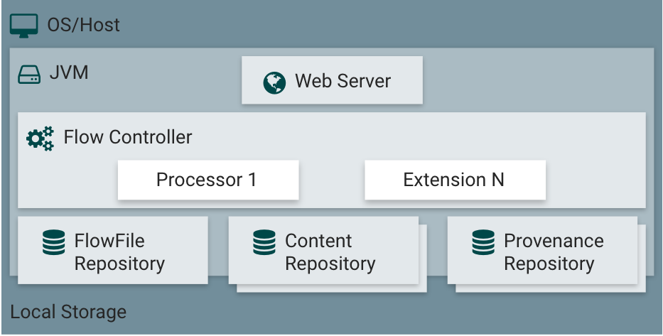
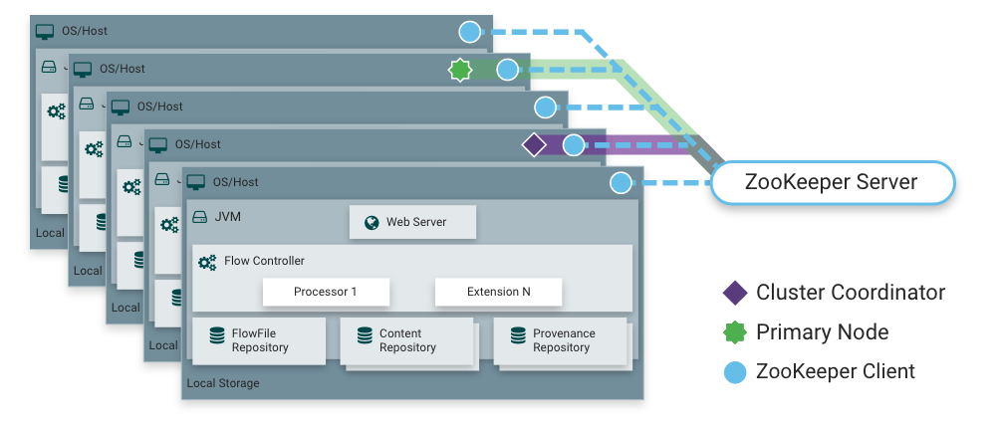
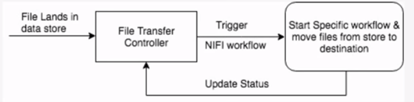
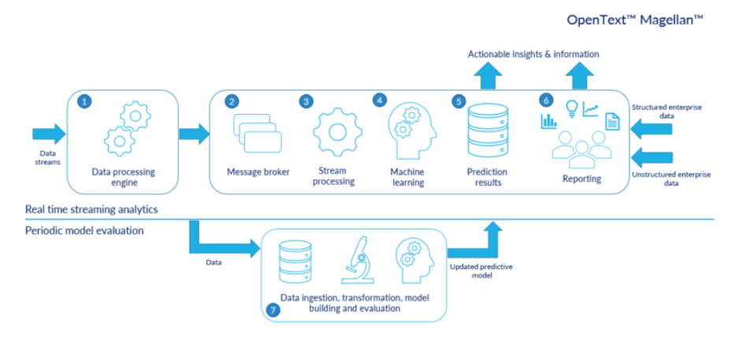

# Apache NiFi :smiley: fa18-523-56  fa18-523-83
 
| Daniel Hinders , Nhi Tran
| dhinders@iu.edu, nytran@iu.edu
| Indiana University
| hid: fa18-523-56 , fa18-523-83
| github: [:cloud:](https://github.com/cloudmesh-community/fa18-523-56/blob/master/paper/paper.md)
 
---
 
Keywords: NiFi, NSA, Data Stream, ETL
 
---

## Apache NiFi Introduction

NiFi is a customizable tool for building flexible data flows while
preserving data provenance and security
[@fa18-523-56-www-nifi-nifihomepage]. NiFi provides the ability to
build or alter an ETL flow with a few clicks. NiFi builds Gets,
Converts, and Pulls in a GUI and allows the user to build and
customize the flow [@fa18-523-56- www-nifi-issartetlsimple]. This
flexibility and usability is key to NiFi's value in a big data world
where stovepipes and inflexibility are frequently challenges.

NiFi is a tool for:

* Moving data between systems, including modern systems such as social
  media sources, AWS cloud server, Hadoop, MongoDB, and so on[@www-fa18-523-56-udemy-nifi]
* Delivering data to analytics platforms[@www-fa18-523-56-udemy-nifi]
* Format Conversion, extracting/parsing data[@www-fa18-523-56-udemy-nifi]
* Data or files routing decisions[@www-fa18-523-56-udemy-nifi]
* Real-time data streaming[@www-fa18-523-56-udemy-nifi]

NiFi is not recommended for:

* Distributed Computation[@www-fa18-523-56-udemy-nifi]
* Complex Event Processing[@www-fa18-523-56-udemy-nifi]
* Join/ Aggregated Functions[@www-fa18-523-56-udemy-nifi]

## Big Data Challanges and NiFi  

Big data can be fantastic source of information for decision making and business 
process definition and actualization. However, the complexity of individual 
datasets, the variability of dataset structure and composition, and the sheer 
volume of data are challenges to truly leveraging big data in the real world. 
This is a multifaceted problem with many inherently overlapping challenges.
ETL or Extract, Transform, and Load encompass a number of potential tasks such
as harvesting and moving data into a database from some other location and/or
and cleaning, normalizing or even structuring data. In a case where a single 
dataset emerges from an ETL process and the data is somewhat structured and 
located somewhere predictably accessible, then we can start to leverage 
analytics or visualization tools to understand the data and use it to make 
decisions and learn things. Furthermore, productization and dissemination 
of that data is fairly straightforward.
 
But this is rarely where the real use case for bigdata solutions ends.
The bigger challenge is dealing with disparate datasets and connecting
points of information in a multi-sourced dataset environment.
Consolidation of disparate data is therefore extremely important.
Furthermore leveraging the the correctly sourced data out of
consolidated datastore environment and then loaded this data into the
correct product is challenging.
 
Apache NiFi is an application that seeks to address this big data
problem. NiFi is tool that has emerged from a unique background as
tool created by the National Security Agency then curated and improved
by the open source community.
 
## NiFi History
 
NiFi was first developed at the National Security Agency but was
released as an open source project to the public.

> "NiFi was submitted to The Apache Software Foundation (ASF) in
> November 2014 as part of the NSA Technology Transfer Program"
> [@fa18-523-56-www-nifi-forbes].

Since then, Apache Foundation has used its volunteer organization to
grow and mature the project [@fa18-523-56-www-nifi-issartetlsimple].
 
## NiFi Features
 
NiFi incorporates a straightforward User Interface (UI) to engineer
traceable data provence with configurable components. NiFi offers up
the ability to custom build processors and incorporate them into a
highly customizable flows. Through

> "data routing, transformation, and system mediation logic"
> [@fa18-523-56-www-nifi-nifihomepage],

NiFi seeks to automate data flows in a big data environment and gives
architects the ability to keep data flowing between evolving systems
quickly. Amongst a host of features NiFi offers, one sticks out as
particularly important because of the challenges associated with what
the feature addresses: data errors, data inconsistency, and data
irregularity handling. NiFi provides users the ability to incorporate
in the flow processes to catch these non-happy path realities in big
data. As new situations are discovered, a user can quickly
build *if-then* forks in the process to catch, store, or resolve the
data issues.
 
NiFi's main features are:
 
* *Guaranteed delivery*: use purpose-built persistent write-ahead log
  and content repository to ensure guaranteed delivery in an effective
  way[@www-nifi]
[@fa18-523-56-www-nifi-homepagetechdoc].
* *Web-based user interface*: easy to use web-based GUI with drag and
  drop features that allows users to build, schedule, control, and
  monitor dataflow[@www-nifi]
[@fa18-523-56-www-nifi-homepagetechdoc].
* *Provenance*: provide ability to track data flows through the
  systems with audit trail and traceability functionalities[@www-nifi]
[@fa18-523-56-www-nifi-homepagetechdoc].
* *Queue Prioritization*: provide the ability to configure and
  prioritize job flow and determine the order of events[@www-nifi]
[@fa18-523-56-www-nifi-homepagetechdoc].
* *Secure*: provide and support multiple security protocols and
  encryptions, as well as authorization management[@www-nifi]
[@fa18-523-56-www-nifi-homepagetechdoc].
* *Extensibility*: provide flexibility by allowing pre-built and
  built-your-own extension the be integrated[@www-nifi]
[@fa18-523-56-www-nifi-homepagetechdoc].
* *Scalability*: supports scale-out by clustering architecture as well
as scale-up and scale-down [@www-nifi]
[@fa18-523-56-www-nifi-homepagetechdoc].

 
## NiFi Architecture

+@fig:nifiarchitecture [fa18-523-56-www-nifi-homepagetechdoc] shows the main components in NiFi architecture.

{#fig:nifiarchitecture}

From the top down, NiFi is web browser accessible by a NiFi hosted Web
Server. NiFi processor operations are managed through the Flow
Controller and the three repositories; FlowFile, Content, and
Provenance work to process data on and off disk and in a NiFi flow.
NiFi is hosted in the Java Virtual Machine environment or JVM
[fa18-523-56-www-nifi-homepagetechdoc].

### Web Server

NiFi's easy-to-use graphic user interface(GUI) is hosted on the Web
Server within the JVM [fa18-523-56-www-nifi-homepagetechdoc].

### Flow Controller

NiFi central operations hub is the Flow Controller. Treads are managed
and allocated to the processors and the FlowFiles are passed through
and managed through the Flow Controller
[@fa18-523-56-www-nifi-hortontransitpatterns].

### FlowFile Repository

Files in an active NiFi flow are tracked in a write ahead log so that
as data moved through the flow NiFi can keep track of what is known
about files as they pass
through[@fa18-523-56-www-nifi-homepagetechdoc].

### Content Repository

The real data for a flow file is in the NiFi content repository. NiFi
uses simple blocks of data in a file system to store this FlowFile
data [@fa18-523-56-www-nifi-homepagetechdoc]. Multiple file systems
can be used in order to increase speed with multiple volumes being
utilized.

### Provenance Repository

In NiFi, the provenance repository stores historic event data. The
provenance data about flows is indexed to enable search of the records
[@fa18-523-56-www-nifi-hortontransitpatterns].

### Processors

NiFi provides more than 260 processors and more than 48 controller
services for users to integrate into a flow from the graphic user
interface(GUI) of Nifi[@fa18-523-56-www-nifi-creatingprocessors].
Processors are base on underlying controller services in the java
virtual machine. Controller services can be centered around a security
implementation, database CRUD (create, read, updates, and deletes),
and many other foundational areas. Users can create custom processors
from existing controller services or create a customer controller
service as well [@fa18-523-56-www-nifi-creatingprocessors].

#### Processor Examples

* **Get**

  * Examples: GetFTP, GetMongo, GetTCP, etc. [@fa18-523-56-www-nifi-homepagetechdoc]
  * Similar input type processors: Consume, Extract, Fetch, Listen, etc.

Nifi provides dozens of *Get* processor options and many other similar
input type processors. A *Get* processer is commonly used to pick up a
file or data and launch a FlowFile. The *Get* file processer setup
typically gives configuration options to point to a host, set timing
increments for polling and timeouts, set proxy settings, and more
[@fa18-523-56-www-nifi-homepagetechdoc].

* **Convert**

  * Examples: ConvertJSONToSQL, Convert Record, ConvertExceltoCSVProcessor, etc. [@fa18-523-56-www-nifi-homepagetechdoc]
  * Similar transformation type processors: Evaluate, Merge, Split, etc. 

Once data is in the flow, NiFi provides dozens of processors to
manipulate or transform data. The *Convert* processors can be
configured to the expected schema or type from the *Get* processor and
tranform, edit, thin, enrich, or many other functions on the data in
the flow [@fa18-523-56-www-nifi-homepagetechdoc].

* **Put**

  * Examples: PutFile, PutFTP, PutSQL, PutElasticSearch, PutAzureBlobStorage, etc. [@fa18-523-56-www-nifi-homepagetechdoc]
  * Similar output type processors: Publish, etc. 

A critical part of a flow in NiFi is pushing the right data out of the
flow into the right spot. There are dozens of *Put* processors that
can be configured to set the directory to write files too. Additional
configuration options are specific to the destination type to include
SSL configuration, cache options, batching options, and many other
configuration options based on the destination type
[@fa18-523-56-www-nifi-homepagetechdoc].

### NiFi Clusters

NiFi can also be integrated with ZooKeeper to operate within a
cluster. +@fig:nificlusterarchitecture
[fa18-523-56-www-nifi-homepagetechdoc] shows how ZooKeeper manages
NiFi's nodes by determining primary node, Zookeeper Coordinator, and
failover node . Each of the nodes performs the same tasks but
processes different dataset(s) [fa18-523-56-www-nifi-homepagetechdoc].

{#fig:nificlusterarchitecture}

## NiFi Download, Installing and Getting Started

NiFi can be downloaded and installed from its Downloads Page
[@fa18-523-56-nifi-download-page] with Linux/Mac *tarball* option,
or *zip* file option for Windows, or Homebrew option for Mac
[@fa18-523-56-nifi-installation-page].

*For Window*

*Double-click* to run `run-nifi.bat` file from NiFi `bin` subfolder within the installed folder. 

*For Linux/Mac OS X Users*

Use Terminal to run `bin/nifi.sh` . Application will run and will be
shutdown when the command is terminated.

*NiFi as a Service in Linux and Max OS X*

To install NiFi as a Service, run the command `bin/nifi.sh install
<service_name>`. Without specifying specific `<service_name>`, nifi
service name will be defaulted to *nifi*.

To start NiFi service after installation, run sudo `service
<service_name> start` . To stop, run `sudo service <service_name>
stop`

Once NiFi has been started, the GUI can be accessed using web browser
via <http://localhost:8080/nifi> . The port and host name can be
configured and changed depending on which server or setting in
`conf/nifi.properties` is used [@fa18-523-56-nifi-installation-page].

## Use Case

### File Transfer and Routing at MasterCard

MasterCard is a card payment and technology company that connects
digital transactions globally. +@fig:mastercardnififlow
[@www-fa18-523-56-nifi-mastercard] shows one of the use cases for NiFi
at MasterCard, which is a file transfer mechanism.

{#fig:mastercardnififlow}

Batch processing is still a major part of MasterCard's ecosystem which
requires multiple formatted flat files being created, transfered, and
picked up by applications [@www-fa18-523-56-nifi-mastercard].
MasterCard uses NiFi's file transfer features to convert files source
into data stream and perform specific workflow to direct data into
various target systems [@www-fa18-523-56-nifi-mastercard]. Target
system could be a messaging systems, Hadoop landing zone, databases.
NiFi can also feeds data and trigger a map-reduce or spark jobs after
transfer [@www-fa18-523-56-nifi-mastercard].

MasterCard provided a demo which demonstrate the use case of them
using NiFi to call a web services from a file transfer controller, the
data flow then has a mechanism to determine which process groups NiFi
should distribute data into based on file name/ format logic
[@www-fa18-523-56-nifi-mastercard]. The process groups contains
workflow that can either feeds data to a diffrerent system, to Hadoop,
or to Postgres database [@www-fa18-523-56-nifi-mastercard]. Once each
process flow are completed, the process status will be captured and
reported into a Status Handler process
[@www-fa18-523-56-nifi-mastercard].

### Streaming Analytics Solutions at OpenText Magellan

OpenText Magellan is an artifical intelligence product that supports
machine learning and advance analytics. At OpenText Magellan
organization, NiFi was utilized as part of their streaming analytics
infrastrusture to allow continuous process and real-time analysis
[@www-fa18-523-56-opentext-magellan-nifi]. OpenText Magellan's
infrastructure involves source applications, NiFi, Apacha Spark,
Python, R, Scala, and other Magellan BI and Reporting tools
[@www-fa18-523-56-opentext-magellan-nifi].
+@fig:opentextmagellannififlow
[@www-fa18-523-56-opentext-magellan-nifi] shows a typical process of
streaming analytics process at Opentext Magellan, which involves six
steps: (1) Data Acquisition, (2) Data Routing, (3) Streaming
Processing, (4) Machine Learning, (5) Prediction Results, and (6)
Actionable Insights [@www-fa18-523-56-opentext-magellan-nifi].

{#fig:opentextmagellannififlow}

NiFi is used during the first Data Acquisition steps to collect data
from multiple sources such as smart devices, social media, online
transactions, and log monitoring
[@www-fa18-523-56-opentext-magellan-nifi]. The real-time data can then
be combined with other historical data or other data sources before
being feed into downstream system
[@www-fa18-523-56-opentext-magellan-nifi]. Data is then being streamed
by Kafka in Data Routing step and then being read and applied business
rules by Spark Streaming API before it is being store in data lake
[@www-fa18-523-56-opentext-magellan-nifi]. Spark Streaming API will
apply machine learning prediction model in Machine Learning step and
then being saved in Prediction Results
[@www-fa18-523-56-opentext-magellan-nifi]. One the result is created,
organizations can take quick decisions to provide business benefits
and insights [@www-fa18-523-56-opentext-magellan-nifi].

As a result, the organization was able to create a low cost solutions
that has the flexibility and extensibility of open source software.

### Social Competitive Intelligence Application at Compose

Compose is an IBM company launched in 2010 that offer databases as a
service on the cloud that are production ready and are easy to manage.
NiFi in being used in Compose as part of their Competitive
Intelligence infrastructure that involves other software such as
Twitter, IBM Watson, Redis, and MongoDB
[@www-fa18-523-56-compose-nifi]. NiFi was used to extract filtered
Twitter Stream data and attributes and send tweet data to IBM Watson
for Sentiment analysis, as well as updating Redis for dashboards and
reporting purpose and at the same time store all data in MongoDB
[@www-fa18-523-56-compose-nifi] .

### Real Time Streaming Architecture at Ford

Ford is an automobiles manufacturing company in the United States.
Being a large company, data are stored and generated constantly in
many applications within the enterprise such as assembly plants data,
vehicle sensor data, dealership data, vehicle dianogstic data, and so
on [@www-fa18-523-56-ford-nifi]. Ford came up with a solution called
Real Time Streaming Architecture (RTSA) to allow data being flow
between systems in real-time with proper data governance
[@www-fa18-523-56-ford-nifi].

Ford's data are being sourced from Open XC which contains vehicle and
phone application data into a private cloud via Cloud Foundry
Websocket or Event Hub [@www-fa18-523-56-ford-nifi]. Data from
Websocket are streamed via Kafka into a cloud-based NiFi cluster
together with the Event Hub data [@www-fa18-523-56-ford-nifi]. From
the cloud-based NiFi Cluster, the combined data then flows to a
private in-house NiFi cluster in Ford's data center and then publish
to Kafka for downstream system distributions or being stored in Hadoop
[@www-fa18-523-56-ford-nifi].
 
## Work Breakdown

* Nhi Tran fa18-523-83

Use Case, NiFi Architecture Images, NiFi Cluster Architecture, NiFi Download Installing and Getting Started

* Daniel Hinders fa18-523-56

Big Data Challanges and NiFi, NiFi History, NiFi Architecture

* Both

NiFi Features

