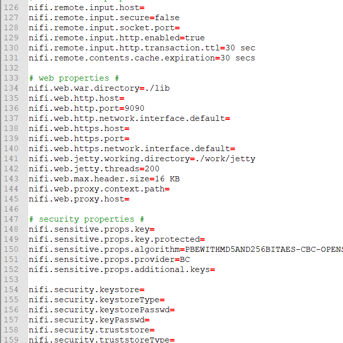

# Apache NiFi Chapter :hand: fa18-523-56

| Daniel Hinders
| dhinders@iu.edu
| Indiana University
| hid: fa18-523-56
| github: [:cloud:](https://github.com/cloudmesh-community/fa18-523-56/blob/master/project-report/report.md)
| code: [:cloud:](https://github.com/cloudmesh-community/fa18-523-56/blob/master/project-code/code)

**:mortar_board: Learning Objectives**

* Learn about NIFI
* Install NIFI and setup a data stream with various processors
---

Keywords: ETL, Data Stream, NiFi, NSA, 


## Apache NiFi Introduction

{#fig:nifiarchitecture}

## NiFi History

## NiFi Features

## NiFi Architecture

## Install NiFi


### Apache NiFi - Windows

(Note: Assumes Windows OS and recent verison of JAVA is installed)

**1**
NiFi can be downloaded from Apache NiFi homepage[@fa18-523-56-nifi-download-page]. Select the latest version and the bin.zip option for the Windows instillation.


{#fig:nifi_download}

**2** Unzip the install package.

**3** Navigate to the configuration directory:
``` 
nifi-1.8.0-bin\nifi-1.8.0\conf
```


{#fig:nifi_config}

Open nifi.properties file with a text editor and edit nifi.web.http.port= to the desired port


{#fig:nifi_properties}

**4** Start up NiFi by navigating to

``` 
nifi-1.8.0-bin\nifi-1.8.0\bin
```


{#fig:nifi_bin}

Run the windows batch file

``` 
run-nifi.bat
```
Wait about 5 minutes for NiFi to load

**5** Open the NiFi GUI by opening a browser and navigate to

```
http://localhost:9090/nifi
```


{#fig:nifi_nifihome}

## Building a NiFi Flow

**1** Add a TailFile Processor by clicking and draging the processor icon fron the top tray to add a processor.
Type into the filter "tail" and select the TailFile processor and click ADD


{#fig:nifi_processor_tailfile}

**2** Configure the TailFile Processor by right-clicking on the process and click configure.


{#fig:nifi_processor_config}

Click the properties tab and click the value for the property "File(s) to Tail"

A box will appear to paste the location of the file to tail. For this example I will use a log file for a music player because it will provide a lot of data.

Use / slash when inputing file path

```
/AppData/Local/Amazon Music/Logs/AmazonMusic.log
```


{#fig:nifi_tailfile_config}

Click OK and then click APPLY

**3** Add a processor called SplitText

Open the configuration options for the processor and on the settings tab in the options for Automatically Terminate Relationships check the boxes "failure" and "original"

This provides direction if there is a failure at this step if a file can't be split any what to do with the original file after it is split. This flexiablity that NiFi provides requires extra configuration choices but provides the NiFi admin extensive control over every aspect of the flow being built.

Click the properties tab and change the property Line Split Count to a value of "1"


{#fig:nifi_splittex_config}

This will split each line of the log file into one row that will be processed independently in the rest of the flow.

**4** Add a processor called RouteOnContent 

Open the configuration options for the processor and on the settings tab in the options for Automatically Terminate Relationships check the box "unmatched" 

Click the properties tab and change the property Match Requirement to "content must contain match" click OK

Click the + in the upper right corner to add a property. 

This property will be used to select a word or pharse from the rows of the log file. When the word is seen in the row the content of the row will be routed down stream. For this example we will use "AddToLibrary" when a user in the music player adds a song to the library
We will use "ClientImplWinHTTP.cpp:525" which is the tag in the log when a song plays in the music player

After naming the new property click OK

[@fa18-523-56-www-nifi-expressionlanguageguide]


### Log File Tail

### 

## Processors

### Setup Routing Processors

### Setup Data Transformation Processors

### Setup Database Access Processors

### Setup System Integration Processors

### AWS Processors

## What is NIFI good for
### source to analytic platform
### 

## What is NIFI not good for
### multiple dataset joins
### not good for aggregation  


## Alternatives to NIFI


*Project Structure from piazza*

## Abstract

TBD

## Introduction

TBD

## Requirements

## Design 

## Architecture

## Dataset

## Implementation

## Benchmark

## Conclusion

## Acknowledgement


Batch vs Live stream (Live)
 
Theory
Implementation (e.g. Python)
Benchmark
A more detailed outline is
Paper
Title
Abstract
Introductions
Requirements
Architecture
Implementation
Benchmark
Conclusions
Bibliography
Work breakdown


